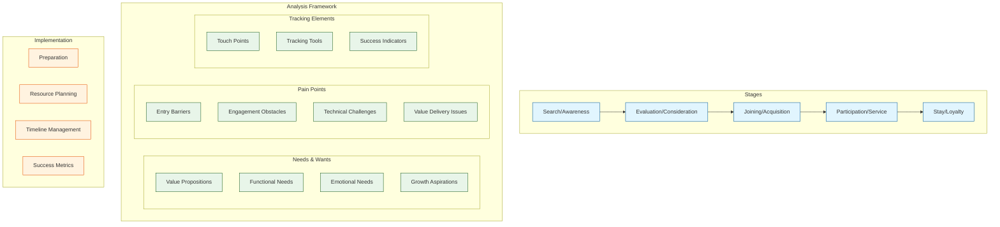
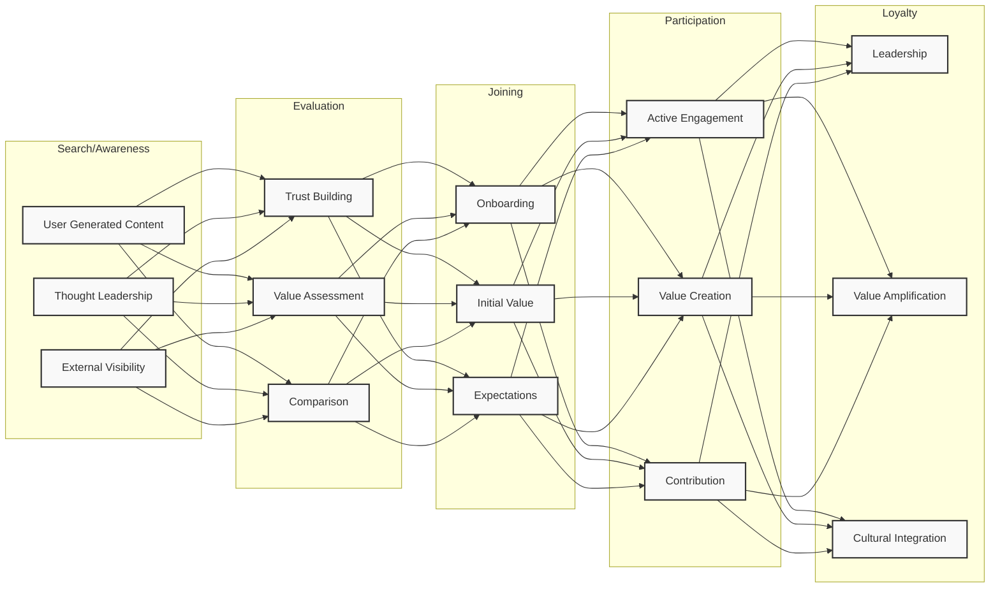

# Appendix A: Community Experience Assessment Framework

## Community Experience Map Overview

## Stage-by-Stage Elements

## Understanding Community Needs

### Core Principles of Needs Assessment

1. **Empathy-First Approach**
   - Develop deep understanding of community emotions and motivations
   - Practice active listening beyond just words
   - Observe non-verbal cues and emotional indicators
   - Build trust through genuine engagement

2. **Systematic Data Collection**
   - Gather both qualitative and quantitative feedback
   - Document community interactions and patterns
   - Track recurring themes and issues
   - Maintain organized records of insights

3. **Context Awareness**
   - Consider cultural and local influences
   - Understand environmental factors
   - Account for community history
   - Recognize existing relationships

### Community Journey Stages

1. **Search/Awareness**
   - Members seeking value and solutions
   - Initial discovery of community
   - First impressions and positioning
   - External visibility and reach

2. **Evaluation/Consideration** 
   - Trust building and credibility
   - Value assessment
   - Comparison with alternatives
   - Decision making factors

3. **Joining/Acquisition**
   - Onboarding experience
   - Initial engagement
   - Early value delivery
   - Setting expectations

4. **Participation/Service**
   - Active engagement
   - Value creation and exchange
   - Relationship building
   - Community contribution

5. **Stay/Loyalty**
   - Long-term engagement
   - Community leadership
   - Value amplification
   - Cultural embodiment

### Key Questions for Community Research

1. **Experience Understanding**
   - "Tell me about the last time you participated in the community..."
   - "What made you join this community initially?"
   - "What keeps you engaged with the community?"
   - "What challenges have you faced within the community?"

2. **Need Identification**
   - "What are you trying to accomplish through this community?"
   - "What would make your experience better?"
   - "What's missing from your current community experience?"
   - "What problems are you trying to solve?"

3. **Value Assessment**
   - "How does this community help you achieve your goals?"
   - "What's the most valuable aspect of the community for you?"
   - "What would make you more likely to contribute?"
   - "What would make you recommend this community to others?"

### Ethics and Best Practices

1. **Data Collection**
   - Obtain clear consent for feedback collection
   - Protect community member privacy
   - Handle sensitive information appropriately
   - Maintain confidentiality when needed

2. **Engagement Guidelines**
   - Be transparent about assessment purposes
   - Respect community boundaries
   - Acknowledge and value all contributions
   - Follow through on commitments

3. **Implementation Standards**
   - Document methodology clearly
   - Use consistent evaluation criteria
   - Maintain objectivity in analysis
   - Share relevant findings with the community

### Common Pitfalls to Avoid

1. **Assessment Process**
   - Rushing to conclusions without sufficient data
   - Imposing external solutions without community input
   - Ignoring minority voices within the community
   - Failing to follow up on feedback

2. **Analysis Mistakes**
   - Confirmation bias in interpreting data
   - Over-generalizing from limited samples
   - Misinterpreting cultural contexts
   - Focusing only on negative feedback

3. **Implementation Errors**
   - Acting without community buy-in
   - Implementing changes too quickly
   - Neglecting to measure impact
   - Failing to adjust based on results

## Experience Mapping Basics

### Key Elements of Experience Maps

1. **Journey Stages**
   - Awareness and Discovery
   - Initial Engagement
   - Active Participation
   - Sustained Involvement
   - Community Leadership

2. **Touchpoint Analysis**
   - Communication channels
   - Interaction points
   - Decision moments
   - Value exchanges

3. **Emotional Mapping**
   - Satisfaction levels
   - Pain points
   - Moments of delight
   - Areas of friction

### Feedback Collection Methods

1. **Direct Engagement**
   - One-on-one interviews
   - Focus group discussions
   - Community surveys
   - Observation sessions

2. **Indirect Monitoring**
   - Activity pattern analysis
   - Engagement metrics
   - Content analysis
   - Behavioral tracking

3. **Validation Techniques**
   - Peer review of findings
   - Community feedback sessions
   - Data triangulation
   - Pattern verification

## Implementation Checklist

### Preparation Steps
- [ ] Define assessment objectives
- [ ] Identify key stakeholders
- [ ] Select appropriate methodologies
- [ ] Prepare necessary tools and resources
- [ ] Train team members on assessment procedures

### Resource Requirements
- [ ] Team allocation
- [ ] Time commitment
- [ ] Budget considerations
- [ ] Technology needs
- [ ] Documentation systems

### Timeline Considerations
1. **Planning Phase** (2-4 weeks)
   - Scope definition
   - Methodology selection
   - Resource allocation
   - Team preparation

2. **Data Collection** (4-8 weeks)
   - Community engagement
   - Feedback gathering
   - Initial analysis
   - Pattern identification

3. **Analysis Phase** (2-4 weeks)
   - Data processing
   - Pattern analysis
   - Insight generation
   - Recommendation development

4. **Implementation** (Ongoing)
   - Action plan development
   - Change management
   - Progress monitoring
   - Impact assessment

### Success Metrics

1. **Engagement Indicators**
   - Participation rates
   - Contribution frequency
   - Retention levels
   - Growth patterns

2. **Value Creation Measures**
   - Problem resolution rates
   - Innovation emergence
   - Knowledge sharing effectiveness
   - Community satisfaction levels

3. **Sustainability Metrics**
   - Long-term engagement
   - Resource utilization
   - Community resilience
   - Growth sustainability