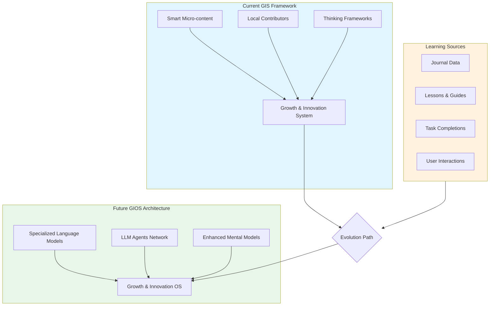
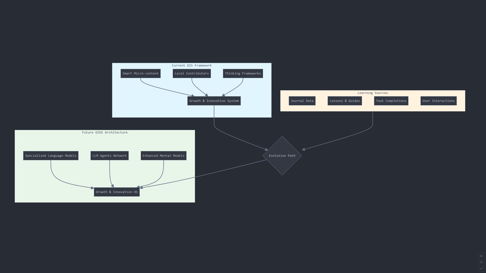

# Evolution from GIS to GIOS: A Technical Framework

## Overview

The Growth and Innovation System (GIS) framework is evolving into a Growth and Innovation Operating System (GIOS) - an AI-powered platform that facilitates learning, innovation, and community growth. This document outlines the evolution path and technical implementation strategy.

## System Architecture

 

## 1. Foundation Building Blocks

The current GIS framework provides three core components that serve as the foundation:

- **Smart Micro-content**: Bite-sized, actionable learning materials
- **Local Contributors**: Community members sharing knowledge and experience
- **Thinking Frameworks**: Structured approaches to problem-solving and innovation

These components create a structured way to:
- Capture knowledge
- Facilitate learning
- Enable community growth

## 2. Evolution Path

GIOS expands beyond human-to-human knowledge transfer by incorporating AI to:

- Analyze journal entries to identify patterns and extract new mental models
- Customize learning paths based on user progress and community needs
- Generate new micro-content adaptively
- Facilitate connections between community members with complementary skills/needs

## 3. AI Integration Strategy

### a) Specialized Language Models (SLMs)
Models trained on specific domains:
- Journal entries to understand learning patterns
- Mental models documentation to grasp thinking frameworks
- Community interactions to understand local context

### b) LLM Agent Network
Multiple specialized agents handling different aspects:
- **Learning Path Agent**: Customizes educational journeys
- **Community Connection Agent**: Facilitates member interactions
- **Innovation Agent**: Identifies patterns and opportunities
- **Feedback Agent**: Provides personalized guidance

## 4. Enhanced Features

### Adaptive Learning
- System learns from user interactions
- Continuously refines mental models
- Generates new micro-content based on community needs

### Automated Connections
- Matches problems with potential solutions
- Connects learners with relevant resources
- Identifies collaboration opportunities

### Pattern Recognition
- Identifies emerging trends in community needs
- Spots potential innovations from journal entries
- Suggests new thinking frameworks based on successful patterns

## 5. Key Advantages

1. **Scalability**
   - AI can handle increasing numbers of users and interactions
   - Automated processing of content and interactions

2. **Personalization**
   - Each user gets customized guidance and resources
   - Adaptive learning paths based on individual progress

3. **Innovation Acceleration**
   - Faster identification and development of solutions
   - Pattern recognition across multiple domains

4. **Community Empowerment**
   - More efficient knowledge sharing
   - Enhanced collaboration opportunities

## 6. Implementation Approach

### Phase 1: Data Collection & Analysis
- Gather more journal entries and user interactions
- Analyze patterns in successful learning and innovation
- Document mental models and thinking frameworks

### Phase 2: AI Integration
- Develop and train specialized language models
- Create and test individual AI agents
- Implement basic automation features

### Phase 3: Network Development
- Connect AI agents into a coordinated network
- Implement learning and adaptation mechanisms
- Begin automated pattern recognition

### Phase 4: Full GIOS Launch
- Deploy complete system with all features
- Monitor and optimize performance
- Continue gathering data for improvements

## Conclusion

The evolution from GIS to GIOS represents a significant advancement in how we facilitate learning and innovation within communities. By maintaining the community-centric, distributed nature of GIS while leveraging AI to enhance and scale its capabilities, GIOS creates a more efficient and effective growth and innovation ecosystem.

The key is that GIOS does not replace human interaction but rather facilitates and augments it. The system learns and adapts alongside the community, creating a symbiotic relationship between human and artificial intelligence that accelerates growth and innovation.

## Next Steps

1. Begin data collection and analysis of current GIS usage
2. Develop prototypes of key AI components
3. Test integration with existing community structures
4. Gather feedback and iterate on the design
5. Plan phased rollout of GIOS features

